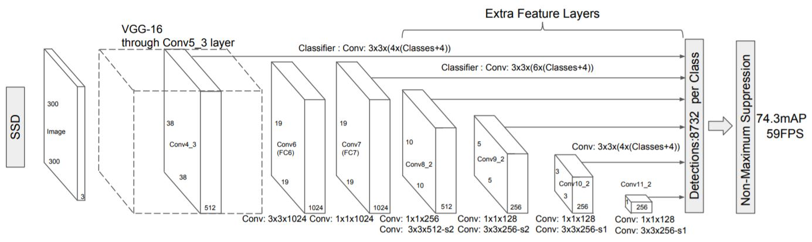
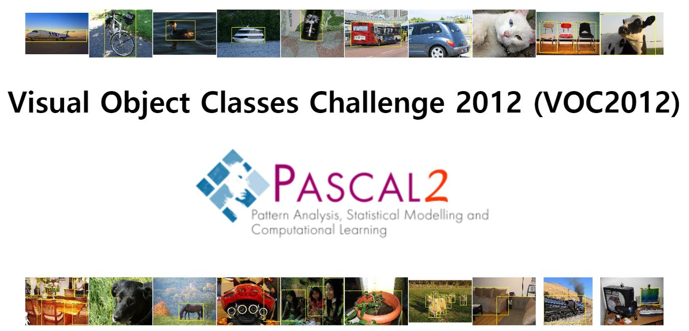

# Let's Detect Obejcts by Keras API

## Introduction

<p align="center">
    </p>

__Object Detection__ is one of the most popular computer vision technologies in many areas.(Face detection, Self-driving car etc) Recently, __Deep Learning__ technology has greatly influenced the Object Detection field, such as accuracy, performance improvement.
There are several popular deep learning algorithms. __Faster R-CNN(2015)__, __YOLO (2015)__, __SSD(2016)__ and __RetinaNet(2017)__. In this tutorial, we will  __SSD(2016)__ to learn what object detection is. 

#### _Why and what is SSD (Single Shot MultiBox Dectector)?_

<p align="center">
    
</p>

In image above, the models marked by red showed excellent result at object detection field.
Among those models, the reasons for selecting SSD in this tutorial are
 - **Fast training** (SSD is 1 stage method and use convolution layer at `Extra Feature Layers`)
 - **Getting high detection accuracy** (SSD produce predictions of diffenrent scales from multiple scale feature maps)
  - **Providing weights (trained by COCO) of SSD in [Tensorflow github](https://github.com/tensorflow/models/blob/master/research/object_detection/g3doc/detection_model_zoo.md)**

So, Let's look at the SSD model structure.

<p align="center">
    
</p>

First, Look at SSD structure image above. The SSD consists of VGG16 and Extra feature layers and uses input images(300*300*3). 


#### _What Dataset use this tutorial?_

<p align="center">
    
</p>

 In fact, many object detection tutorials use famous dataset such as [COCO](http://cocodataset.org/), [VOC2012](http://host.robots.ox.ac.uk/pascal/VOC/voc2012/) etc. Among them, we decided to use VOC2012. ~~insert voc2012 description~~  

## Setting up Environments
In order to running this tutorial(object detection based on deep learning), many development packages and environment settings are needed. **BUT, DON'T WORRY.** In this tutorial, you can easily set up a development environment on your computer or server using a docker. **Just follow this tutorial.**

First, we use a Docker (OS : [Ubuntu](https://docs.docker.com/install/linux/docker-ce/ubuntu/), [windows](https://docs.docker.com/docker-for-windows/)) to set up the developments package and environments required for deep learning development. See below.

```bash
    # yolk/
    $ docker 
```

## Explain Tutorial Code

```python
    import keras
    import yolk
    
    # function path can be changed
    deepfashion2_train, deepfashion2_valid = yolk.datasets.deepfashion2()

    # OD models can be changed
    yolov3 = yolk.models.yolov3()

    # metrics should changed
    yolov3.compile(
        loss = yolk.losses.yolov3loss,
        optimizer='adam', metrics=['yolov3']
    )

    # parameter can be changed
    yolov3.fit_generator(
        generator = deepfashion2_train, 
        validation_data = deepfashion2_valid,
        epochs=20
    )
```

### 1) Download dataset & model
```python
    
```

### 2) Loading pre-trained model & dataset

```python
    
```
### 3) Let's Detect Obejcts!
```python
```

### 4) Result